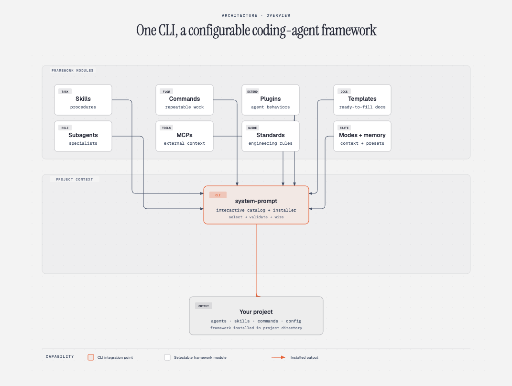

<h1 align="center">
  System prompt 
</h1>

<p align="center">
  
</p>

## Prerequisites

- **Node.js >= 18**

## Quick Start

### Install

```sh
npm install -g @mohammadhprp/system-prompt
```

### Run

```sh
system-prompt
```

The CLI walks you through selecting which skills, agents, commands, MCPs, and references to install, then wires everything into your project directory.

## Contributing

See [CONTRIBUTING](CONTRIBUTING.md). Contributions should improve clarity, correctness, and operational usefulness. Avoid duplicating guidance that belongs in standards.

## License

[MIT](LICENSE)
