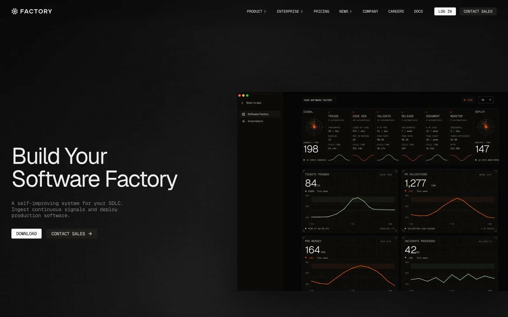
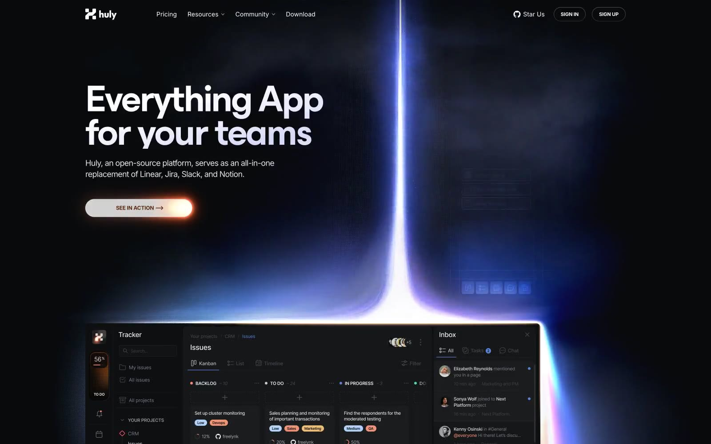
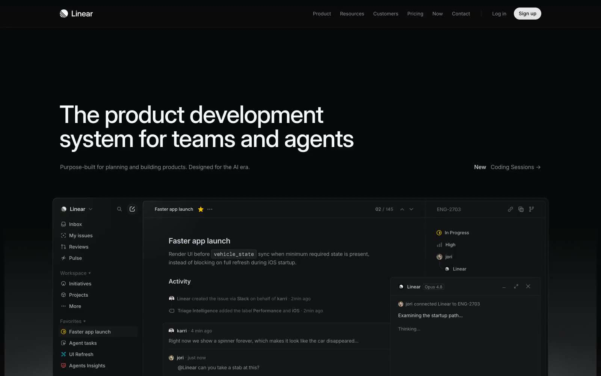

# Style Catalog

A curated catalog of design system references from [Refero Styles](https://styles.refero.design/). Each entry provides a complete breakdown of colors, typography, spacing, components, and design tokens — ready to use as a `DESIGN.md` reference for AI coding agents.

## Available Styles

| Style | Description | Preview |
| --- | --- | --- |
| [Factory](./factory/README.md) | Terminal war room — stark black canvas, light figure-ground cards, and restrained orange/green data signals. |  |
| [Huly](./huly/README.md) | Midnight observatory — violet-to-coral aurora hero, dark productivity surfaces, and pill-shaped controls. |  |
| [Linear](./linear/README.md) | Midnight precision instrument — near-black surfaces, acid-lime accent, tight Inter typography. |  |
| [Notion](./notion/README.md) | Warm paper notebook — off-white canvas, editorial typography, blue primary action, and playful accent panels. |  |
| [Raycast](./raycast/README.md) | Midnight command center, coral neon — almost-black canvas, warm coral brand accent, glass navigation. |  |

## How Styles Are Organized

Each style entry follows this structure:

```text
styles/<style-name>/
├── README.md       # Concise style overview and implementation guidelines
├── DESIGN.md       # Full design system reference: palette, typography, spacing, components, tokens
└── assets/         # Preview images and other style assets, when provided
```

## How to Use a Style

1. Open the style's `README.md`.
2. Copy the CSS custom properties or Tailwind v4 theme into your project.
3. Reference the component guidelines, typography scale, and spacing rules when building UI.
4. Use the do's and don'ts to maintain design consistency.

## Source

All styles are sourced from [Refero Styles](https://styles.refero.design/) — a library of AI-readable design system examples from leading product websites.

## Related Repository Areas

- [`skills/`](../skills/) contains task-specific procedures for AI coding agents.
- [`references/standards/`](../references/standards/) contains canonical engineering rules.
